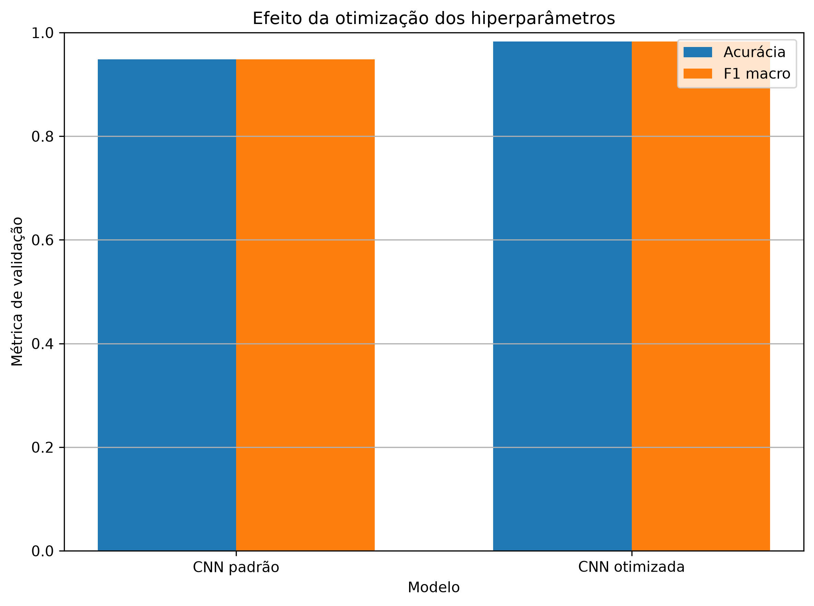
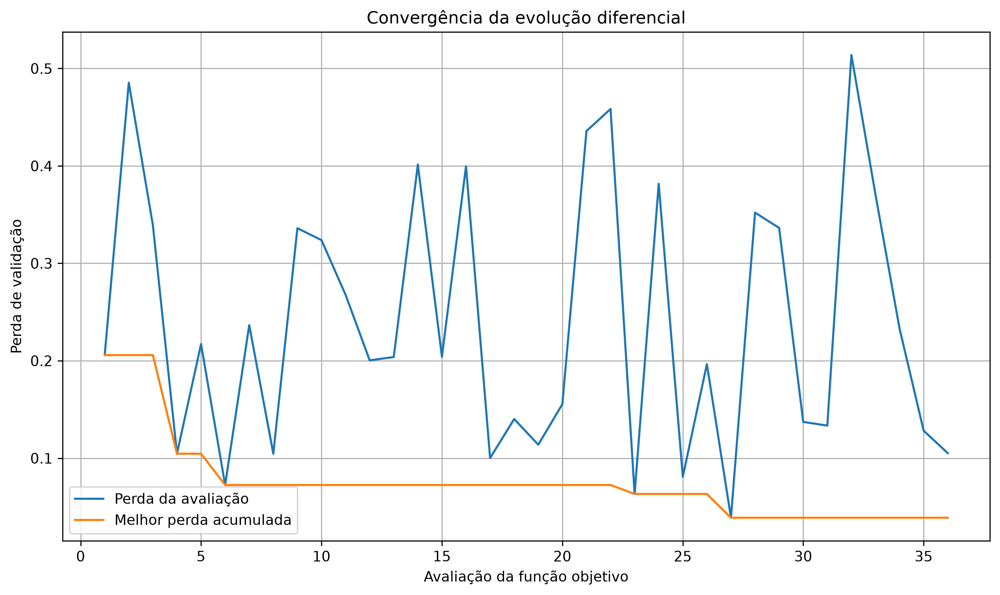

# Classificação de ambientes internos por medições do canal sem fio em 2,4 GHz

Classificação de ambientes internos a partir de medições reais da resposta em frequência de um canal sem fio, utilizando redes neurais e otimização não linear de hiperparâmetros.

O projeto é desenvolvido na disciplina PRO6006 — Métodos de Otimização Não Linear com Aplicações em Aprendizado de Máquina.

## Problema de pesquisa

O objetivo é investigar como diferentes representações da resposta complexa do canal e diferentes arquiteturas de redes neurais afetam a classificação de ambientes internos.

A etapa atual considera:

- representação cartesiana, formada pelas partes real e imaginária de \(S_{21}(f)\);
- representação polar, formada pela magnitude em decibéis e pela fase desembrulhada;
- representação temporal, ou no domínio do atraso, obtida pela transformada inversa de Fourier;
- rede neural perceptron multicamadas;
- rede neural convolucional unidimensional;
- otimização de hiperparâmetros da CNN por evolução diferencial.

A função objetivo utilizada na otimização é a perda de entropia cruzada no conjunto de validação. A quantidade de parâmetros e o tempo computacional são registrados para comparação, mas ainda não fazem parte diretamente da função objetivo.

## Base de dados

O projeto utiliza a base **2.4 GHz Indoor Channel Measurements**, disponibilizada pelo UCI Machine Learning Repository.

A base contém medições realizadas em quatro ambientes:

- corredor;
- laboratório;
- saguão principal;
- ginásio esportivo.

Cada medição possui 601 amostras complexas do coeficiente de transmissão \(S_{21}(f)\), entre 2,4 GHz e 2,5 GHz.

| Característica | Quantidade |
|---|---:|
| Ambientes | 4 |
| Posições físicas por ambiente | 196 |
| Repetições por posição | 10 |
| Medições totais | 7.840 |
| Pontos de frequência por medição | 601 |
| Grade espacial por ambiente | \(14 \times 14\) |

Página da base:

[2.4 GHz Indoor Channel Measurements — UCI](https://archive.ics.uci.edu/dataset/480/2%2B4%2Bghz%2Bindoor%2Bchannel%2Bmeasurements)

DOI:

[`10.24432/C5T60D`](https://doi.org/10.24432/C5T60D)

## Divisão sem vazamento de dados

As dez medições consecutivas obtidas em uma mesma posição física apresentam forte relação entre si. Uma separação aleatória dessas repetições poderia colocar medições praticamente equivalentes nos conjuntos de treinamento e avaliação, produzindo uma estimativa excessivamente otimista.

Por isso, a divisão é realizada por posição física dentro de cada ambiente. Todas as repetições de uma posição permanecem no mesmo subconjunto.

A divisão utilizada é reproduzível, utiliza semente aleatória 42 e preserva o equilíbrio entre as quatro classes.

| Subconjunto | Posições por ambiente | Grupos físicos | Medições |
|---|---:|---:|---:|
| Treinamento | 137 | 548 | 5.480 |
| Validação | 29 | 116 | 1.160 |
| Teste | 30 | 120 | 1.200 |

O conjunto de teste permanece reservado e ainda não foi utilizado na seleção de representações, arquiteturas ou hiperparâmetros.

## Fluxo de processamento

O programa executa as seguintes etapas:

1. baixa ou reutiliza o arquivo ZIP original da UCI;
2. lê os arquivos CSV diretamente do ZIP;
3. identifica ambiente, posição física e repetição;
4. extrai as partes real e imaginária de \(S_{21}\);
5. valida a grade de frequências e as dimensões das medições;
6. constrói uma base NumPy compactada;
7. cria a divisão por grupos físicos;
8. gera as representações cartesiana, polar e temporal;
9. normaliza os dados utilizando exclusivamente o conjunto de treinamento;
10. executa a análise exploratória;
11. treina as redes MLP;
12. treina a CNN 1D;
13. otimiza os hiperparâmetros da CNN por evolução diferencial.

## Modelos

### Perceptron multicamadas

A MLP recebe os 601 pontos e os dois canais de cada representação em um vetor com 1.202 entradas.

A arquitetura utilizada possui:

- 32 neurônios na primeira camada oculta;
- 16 neurônios na segunda camada oculta;
- 4 saídas;
- ativação ReLU;
- otimizador Adam;
- parada antecipada pela perda de validação.

### CNN unidimensional

A CNN processa os 601 pontos como uma sequência com dois canais de entrada.

A arquitetura padrão possui três camadas convolucionais, normalização em lote, ativação ReLU, pooling, uma camada densa e quatro saídas.

A arquitetura otimizada encontrada possui:

- 32, 64 e 128 filtros convolucionais;
- 96 neurônios na camada densa;
- dropout de aproximadamente 0,0501;
- lote de 32 amostras;
- taxa de aprendizado de aproximadamente 0,001866;
- decaimento dos pesos de aproximadamente 0,000337.

## Otimização dos hiperparâmetros

A configuração da CNN é representada por um vetor de variáveis contínuas e discretizadas:

\[
\boldsymbol{x}
=
\begin{bmatrix}
\log_{10}(\eta) &
\log_{10}(\lambda) &
d &
i_f &
i_h &
i_b
\end{bmatrix}^{T},
\]

em que:

- \(\eta\) é a taxa de aprendizado;
- \(\lambda\) é o decaimento dos pesos;
- \(d\) é a taxa de dropout;
- \(i_f\) seleciona a quantidade de filtros;
- \(i_h\) seleciona a quantidade de neurônios da camada densa;
- \(i_b\) seleciona o tamanho do lote.

O problema é formulado como:

\[
\min_{\boldsymbol{x}}
J(\boldsymbol{x})
=
\mathcal{L}_{\mathrm{val}}
\left(
\boldsymbol{\theta}^{*}(\boldsymbol{x})
\right),
\]

com:

\[
\boldsymbol{\theta}^{*}(\boldsymbol{x})
=
\arg\min_{\boldsymbol{\theta}}
\mathcal{L}_{\mathrm{treino}}
\left(
\boldsymbol{\theta};
\boldsymbol{x}
\right).
\]

A busca foi realizada por evolução diferencial, com seis variáveis e 36 avaliações da função objetivo.

## Resultados preliminares

Todos os valores desta seção foram obtidos no conjunto de validação.

| Modelo | Representação | Perda | Acurácia | F1 macro | Parâmetros |
|---|---|---:|---:|---:|---:|
| MLP | Polar | 0,459202 | 87,24% | 87,24% | 39.092 |
| MLP | Cartesiana | 0,255765 | 90,60% | 90,56% | 39.092 |
| MLP | Temporal | 0,186860 | 93,62% | 93,55% | 39.092 |
| CNN 1D padrão | Temporal | 0,129919 | 94,83% | 94,84% | 75.124 |
| CNN 1D otimizada | Temporal | 0,038901 | 98,28% | 98,28% | 233.028 |

A otimização reduziu a perda de validação da CNN em aproximadamente 70% e elevou a acurácia de 94,83% para 98,28%.

Esses resultados não representam ainda o desempenho final de generalização, pois as configurações foram selecionadas a partir do conjunto de validação. A avaliação final será realizada posteriormente no conjunto de teste reservado.

### Comparação entre a CNN padrão e a CNN otimizada



### Convergência da evolução diferencial



Os valores completos das avaliações, históricos de treinamento e matrizes de confusão estão disponíveis nas pastas [`resultados`](resultados) e [`graficos`](graficos).

## Estrutura do projeto

```text
controller/       Coordenação das etapas executadas pela aplicação
dados/            Documentação e arquivos locais da base
ferramentas/      Download da base original
graficos/         Figuras geradas pelos experimentos
model/            Entidades, acesso aos dados e modelos de redes neurais
modelos/          Modelos treinados mantidos apenas localmente
resultados/       Resultados numéricos e tabelas em CSV
services/         Processamento, análise, treinamento e otimização
test/             Testes automatizados
main.py           Interface principal da aplicação
requirements.txt  Dependências do projeto
```

Os arquivos da base, as bases NumPy preparadas e os modelos treinados não são armazenados no repositório.

## Requisitos

A implementação foi desenvolvida e testada com:

- Windows 10;
- Python 3.12;
- NumPy;
- SciPy;
- scikit-learn;
- Matplotlib;
- PyTorch com suporte a CUDA.

Uma GPU NVIDIA é recomendada para o treinamento da CNN e para a otimização dos hiperparâmetros. Quando CUDA não está disponível, o treinador pode utilizar a CPU.

A configuração atual do `requirements.txt` utiliza o pacote do PyTorch para CUDA 12.6.

## Instalação

```cmd
git clone https://github.com/yurimonteiro94/indoor-channel-classification-24ghz.git
cd indoor-channel-classification-24ghz

python -m venv .venv
call .venv\Scripts\activate.bat

python -m pip install --upgrade pip
python -m pip install -r requirements.txt
```

## Execução

Para visualizar os comandos disponíveis:

```cmd
python main.py ajuda
```

Para executar todo o fluxo:

```cmd
python main.py executar-pipeline
```

As etapas também podem ser executadas separadamente:

```cmd
python main.py baixar-base
python main.py processar-base
python main.py preparar-experimentos
python main.py gerar-analise
python main.py treinar-mlp
python main.py treinar-cnn
python main.py otimizar-cnn
```

## Testes automatizados

```cmd
python main.py testar
```

Também é possível executar diretamente o `unittest`:

```cmd
python -m unittest discover -s test -p "test_*.py" -v
```

A versão atual possui 38 testes automatizados.

## Arquivos gerados localmente

O processamento da base produz:

```text
dados/canal_24ghz.zip
dados/base_canal_24ghz.npz
dados/base_preparada_24ghz.npz
```

Os modelos treinados são armazenados em:

```text
modelos/
```

Esses arquivos são ignorados pelo Git.

## Estado atual e próximas etapas

A implementação atual concluiu:

- preparação da base sem vazamento entre posições;
- análise exploratória;
- comparação das três representações;
- treinamento da MLP;
- treinamento da CNN 1D;
- otimização da CNN por evolução diferencial;
- geração de tabelas, gráficos e matrizes de confusão.

As próximas etapas incluem:

- avaliação final no conjunto de teste reservado;
- análise da redução do número de pontos de frequência;
- estudo mais detalhado do custo computacional;
- experimentos de robustez;
- consolidação do artigo final.

## Fonte e licença dos dados

A base é distribuída pelo UCI Machine Learning Repository sob a licença Creative Commons Attribution 4.0 International.

Este repositório não redistribui os arquivos brutos da base. Para reproduzir os experimentos, os dados devem ser obtidos diretamente da fonte original.

## Licença do código

O código-fonte deste repositório é disponibilizado sob a Licença MIT. Consulte o arquivo [LICENSE](LICENSE).
